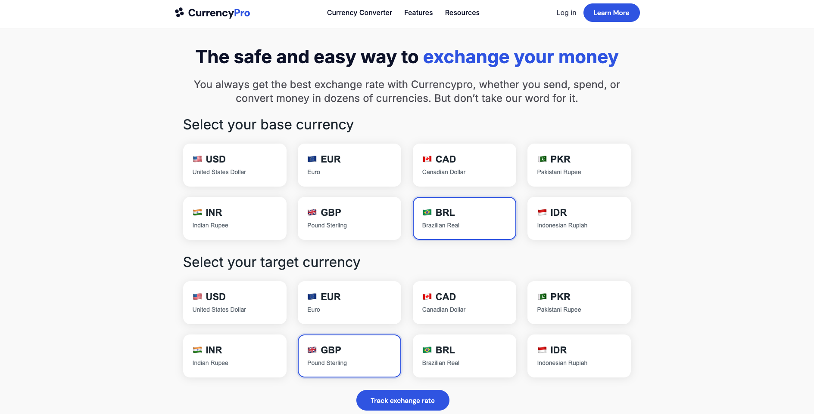
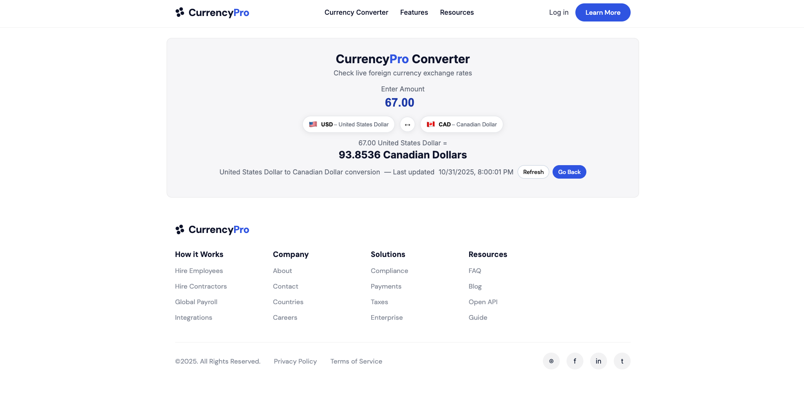
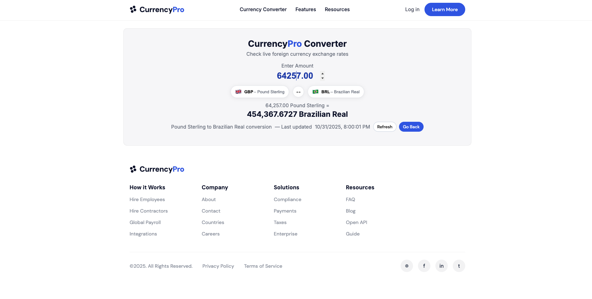

# CurrencyPro

A modern currency converter web application that allows users to convert between different currencies and track exchange rates.

## Major Features
- Real-time currency conversion
- Interactive currency selection with visual feedback
- Support for multiple international currencies
- Track exchange rates functionality
- Responsive 4x2 grid layout for currency selection

## Key Components
- Currency selection cards with hover effects
- Visual feedback for selected currencies
- Clean and modern user interface
- Real-time exchange rate updates
- Mobile-responsive design

## Libraries and APIs Used
- Vanilla JavaScript for core functionality
- ExchangeRate-API for real-time currency data
- CSS Grid and Flexbox for responsive layout
- No external dependencies required!

## Running Locally
1. Clone the repository
2. Create a `config.json` file in the root directory with your API key:
   ```json
   {
     "apiKey": "your_api_key_here"
   }
   ```
3. Get your API key from [ExchangeRate-API](https://www.exchangerate-api.com/)
4. Open `index.html` in your browser

## Screenshots

### Main Page


### Currency Converter


### Currency Selection
